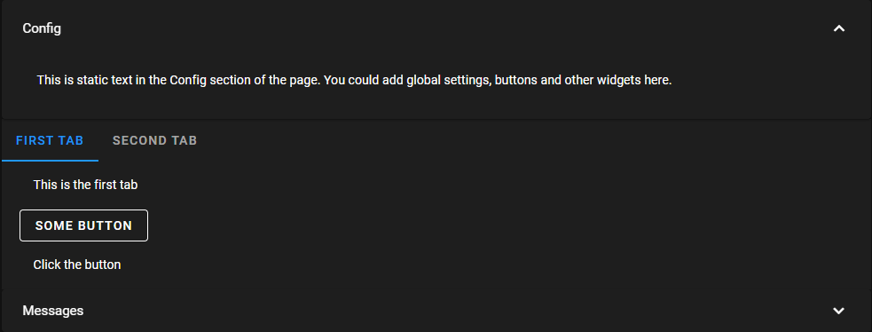

[](https://pypi.python.org/pypi/nbappinator)
[](https://anaconda.org/conda-forge/nbappinator)
[](https://github.com/iqmo-org/nbappinator/actions/workflows/build_release.yml)
[](https://github.com/iqmo-org/nbappinator/actions/workflows/test_coverage.yml)

<!--[](https://htmlpreview.github.io/?https://github.com/iqmo-org/nbappinator/blob/python-coverage-comment-action-data/htmlcov/index.html)-->

[](https://htmlpreview.github.io/?https://github.com/iqmo-org/nbappinator/blob/python-coverage-comment-action-data/htmlcov/index.html)

# Introduction

nbappinator streamlines Jupyter and Voila app development through a structured, opinionated framework for UI construction. Adding a button to a page is as simple as using app.page[0].add_button(...).

nbappinator has three goals:

- Simplify UI development for Notebook developers by reducing the surface area of APIs to learn.
- Abstract the underlying UI components, allowing nbappinator to plug in different frameworks to achieve equivalent behavior.
- Provide a foundation to develop reusable and portable themes to improve app styling.

# Example

<!---->

# Getting Started

```py
import nbappinator as nbapp

def my_action(component, action, args, app: nbapp.UiModel, caller: str):
    with app.messages:
        print("This message will be written to the Messages footer")
        app.get_page(0).add_textstatic("This is some text")

def choose_action(component, action, args, app: nbapp.UiModel, caller: str):
    with app.messages:
        chosen_value = app.get_values(caller)
        print(f"You chose {chosen_value}")
        app.get_page(1).add_textstatic(f"You chose {chosen_value}")

# Create a Tabbed UI comprised of three sections:
# "Config" Header,  Tabbed Pages: "First Tab" and "Second Tab", and a "Messages" Footer
myapp = nbapp.TabbedUiModel(pages=["First Tab", "Second Tab"], log_footer = "Messages", headers=["Config"])
myapp.get_page("Config").add_textstatic("This is static text in the Config section of the page. You could add global settings, buttons and other widgets here.")

# Add a button to First Tab
myapp.get_page(0).add_textstatic("This is the first tab")
myapp.get_page(0).add_button(name="but1", label="Some button", action=my_action)
myapp.get_page(0).add_textstatic("Click the button")

# Add a dropdown selection to Second Tab
myapp.get_page(1).add_select(name="choose1", label="Choose A Number", options=list(range(10)), action=choose_action)

# Render the app:
myapp.display()
```

# Deployment and BQuant

nbappinator was originally designed to simplify developing applications within Bloomberg's BQuant environment, which provides a managed but locked down Jupyter environment with a Voila-based deployment of applications.

# Acknowledgements

nbappinator builds on some great projects that provide useful building blocks in Jupyter, which themselves build on other great web technologies. At the same time, nbappinator is implementation agnostic - a core goal is to allow any of these components to be swapped out.

[ipyvuetify](https://ipyvuetify.readthedocs.io/en/latest/) provides the underlying UI widgets, bringing modern VUE components to Jupyter.

[AG Grid](https://ag-grid.com/) is an excellent javascript grid library, which [ipyaggrid](https://github.com/widgetti/ipyaggrid) provides as an Jupyter extension.

[Plotly](https://plotly.com/) is given first class support, although any matplotlib charting library works, such as Seaborn.

This all builds on [Jupyter](https://jupyter.org/) and [ipywidgets](https://ipywidgets.readthedocs.io/en/stable/).

# Testing Notes

A significant portion of the tests are Notebook smoketests designed to exercise the code base in its entirety. The coverage report primarily reflects the percentage of the code base that the Notebooks exercise: but manual verification of the Notebook behavior is still required.

Some assertions are baked into the Notebooks, but largely its intended to ensure that all the features are exercised.
